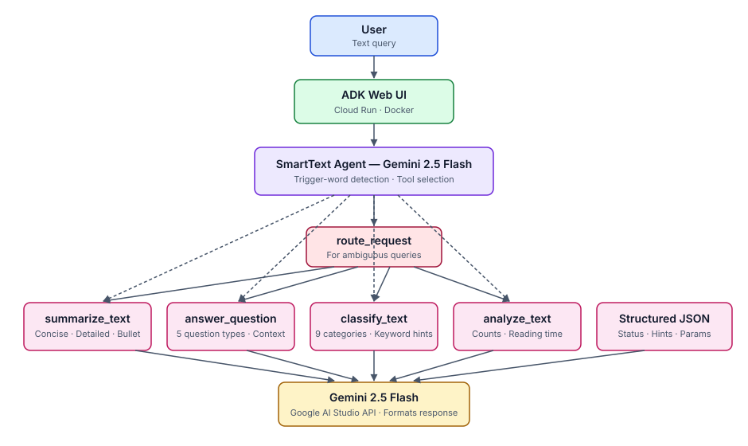

# SmartText Agent

> A Google ADK tool-calling agent for summarization, question answering,
> classification assistance, text statistics, and intent routing.

[Live demo](https://smart-text-agent-381066349460.us-central1.run.app) |
[Architecture](architecture.svg) |
[Security](SECURITY.md)

SmartText Agent demonstrates how a Gemini model can orchestrate small,
deterministic Python tools through Google Agent Development Kit (ADK). The
tools validate and prepare user input; Gemini selects a capability and formats
the final response.

Built for the **Google Cloud Gen AI Academy APAC Edition, Track 1**.

## What It Demonstrates

- Google ADK agent and function-tool configuration
- Gemini function calling with explicit routing instructions
- Deterministic input validation and structured tool responses
- Whole-word intent and keyword detection
- Containerized deployment to Google Cloud Run
- Offline unit tests and GitHub Actions CI

## Architecture



```text
User request
    |
    v
ADK web interface
    |
    v
Gemini 2.5 Flash agent
    |
    +--> summarize_text
    +--> answer_question
    +--> classify_text
    +--> analyze_text
    `--> route_request --> recommended capability
```

## Capabilities

| Tool | Deterministic responsibility | Model responsibility |
|---|---|---|
| `summarize_text` | Validate input, style, counts, and target length | Write the summary |
| `answer_question` | Detect question type and attach optional context | Produce the answer |
| `classify_text` | Find category-specific whole-word keyword hints | Select and explain the category |
| `analyze_text` | Calculate words, sentences, characters, average word length, and reading time | Format the statistics |
| `route_request` | Detect intent signals and recommend a tool | Follow through with the selected capability |

The classifier is intentionally hybrid: keyword hints are deterministic, while
the final semantic classification is performed by Gemini. It is not a trained
or benchmarked text-classification model.

## Example Prompts

```text
Summarize this in bullet points: <long text>

What is Kubernetes and when should a team use it?

Classify this text: The company reported record quarterly revenue.

Analyze this paragraph and estimate its reading time.
```

## Run Locally

Requirements:

- Python 3.11+
- A Gemini API key from [Google AI Studio](https://aistudio.google.com/apikey)

```powershell
git clone https://github.com/VishwasPrabhakara/smart-text-agent.git
cd smart-text-agent

python -m venv .venv
.\.venv\Scripts\Activate.ps1
python -m pip install --upgrade pip
pip install -r requirements.txt

Copy-Item .env.example .env
# Add GOOGLE_API_KEY to .env

adk web --port 8000 --host 127.0.0.1 agents
```

Open `http://127.0.0.1:8000` and select `smart_text_agent`.

The ADK web UI is a development and demonstration interface. Add a dedicated
frontend, authentication, rate limiting, and production observability before
using the service for sensitive or public workloads.

## Tests

The automated suite tests tool contracts without making Gemini API calls:

```powershell
pip install -r requirements-dev.txt
pytest
```

These tests verify routing, validation, keyword boundaries, statistics, and
agent tool registration. They do not measure final LLM response quality or
tool-selection accuracy. A model-level ADK evaluation set is future work; no
evaluation scores are claimed here.

## Docker

```powershell
docker build -t smart-text-agent .
docker run --rm -p 8080:8080 --env-file .env smart-text-agent
```

The container runs as a non-root user and respects the `PORT` environment
variable.

## Cloud Run

Google recommends the ADK deployment command for Python agents:

```powershell
adk deploy cloud_run `
  --project=YOUR_PROJECT_ID `
  --region=us-central1 `
  --service_name=smart-text-agent `
  --with_ui `
  agents/smart_text_agent
```

`--with_ui` is appropriate for this public demonstration, but Google documents
the bundled UI as a development/testing surface. Store credentials in Cloud Run
configuration or Secret Manager rather than in the image.

## Limitations

- Responses depend on Gemini and may be incorrect or inconsistent.
- Classification categories are fixed and have not been benchmarked.
- Keyword routing is rule-based and supports only the documented intents.
- User text is sent to Gemini; the application does not perform redaction.
- The repository does not include application authentication, persistent
  sessions, rate limiting, or production monitoring.
- Cloud Run may scale to zero, so the live demo can have a cold-start delay.

## Project Structure

```text
smart-text-agent/
|-- .github/workflows/tests.yml
|-- agents/
|   `-- smart_text_agent/
|       |-- __init__.py
|       `-- agent.py
|-- tests/
|   |-- test_agent.py
|   `-- test_tools.py
|-- .env.example
|-- architecture.svg
|-- Dockerfile
|-- requirements.txt
|-- requirements-dev.txt
`-- SECURITY.md
```

## Author

**Vishwas Prabhakara**

[GitHub](https://github.com/VishwasPrabhakara) |
[LinkedIn](https://www.linkedin.com/in/vishwas-prabhakara)

## License

[Apache-2.0](LICENSE)
